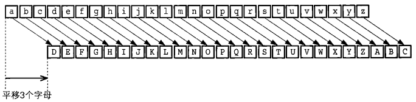
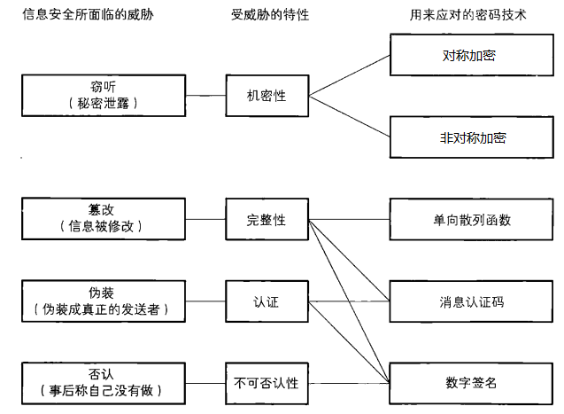

## 1. 第1天 - 对称加密

### 1.1 基础知识点

1. 知识点大纲介绍
   - 密码的基础概念
   - 对称加密
   - 非对称加密
   - 单向散列函数
     - 哈希函数
   - 消息认证码
   - 数字签名
   - 证书
   - ssl/tls - https

2. 为什么要加密, 以及解决方案       

   保证数据安全   

3. 加密三要素

   - 明文/密文
   - 秘钥
     - 定长的字符串
     - 需要根据加密算法确定其长度
   - 算法
     - 加密算法
     - 解密算法
     - 加密算法和解密算法有可能是互逆的, 也有可能相同

4. 常用的两种加密方式   

   - 对称加密
     - 秘钥: 加密解密使用的是同一个秘钥, 秘钥有一个
     - 特点
       - 双方向保证机密性
       - 加密效率高, 适合加密大数据, 大文件
       - 加密强度不高, 相对于非对称加密
   - 非对称加密
     - 秘钥: 加密解密使用的不同的秘钥, 秘钥有两个, 需要使用秘钥生成算法, 得到密钥对
       - 公钥 - 可以公开的秘钥
         - 公钥加密数据, 解密需要使用私钥
       - 私钥 - 需要妥善保管的秘钥, 知道的人越少越好
         - 私钥加密, 公钥解密
     - 特点:
       - 数据的机密性只能单方向保证
       - 加密效率低, 适合加密少量数据
       - 加密强度高, 相对于对称加密

5. 凯撒密码 

   恺撒密码（Caesar cipher）是一种相传尤利乌斯·恺撒曾使用过的密码。恺撒于公元前100年左右诞生于古罗马，是一位著名的军事统帅。

   > <font color="red">恺撤密码是通过将明文中所使用的字母表按照一定的字数“平移”来进行加密的</font>。

   

   - 凯撒密码加解密公式

     - 加密

     

     - 解密

       

   - 凯撒密码中的加密三要素

     - 明文/密文
       - 明文: 小写字母表中的数据
       - 密文: 大写字母表中的数据
     - 秘钥
       - 按照上图秘钥为3
     - 算法
       - 加密: +3
       - 解密: -3

   - 凯撒密码的安全性

     不安全

6. 密码信息安全常识 

   - 不要使用保密的密码算法（普通公司和个人）
   - 使用低强度的密码比不进行任何加密更危险
   - 任何密码总有一天都会被破解
   - 密码只是信息安全的一部分                   

7. 密码信息威胁 

   

   思考：信息安全处理必须要具备哪些特性？                                        

### 1.2 对称加密

> 以分组为单位进行处理的密码算法称为**分组密码（blockcipher）**

1. 编码的概念

   G = 1024m

   m = 1024kbyte

   byte  = 8bit

   bit 0/1

   > 计算机的操作对象并不是文字，而是由0和1排列而成的**比特序列**。
   >
   > 将现实世界中的东西映射为比特序列的操作称为**编码（encoding）**。
   >
   > 加密 -> 编码
   >
   > 解密 -> 解码

   hello world -> 比特序列

   h -> int 104 -> 

2. DES   --   Data Encryption Standard

   - 现在使用DES方式加密，数据还安全吗？
     - 不安全, 已经被破解了
   - 是不是分组密码？
     - 是, 先对数据进行分组, 然后在加密或解密
   - DES的分组长度?
     - 8byte == 64bit
   - DES的秘钥长度?
     - 56bit秘钥长度+8bit错误检测标志位 = 64bit == 8byte

3. 3DES   --   Triple-DES

   - 3DES安全吗?
     - 安全, 但是效率低
   - 算法描述?
     - 进行了3次des加密
   - 是不是分组密码?
     - 是
   - 3DES分组长度?
     - 8字节
   - 3DES秘钥长度?
     - 24字节, 在算法内部会被平均分成3份
   - 3DES加密过程?
     - 秘钥1 -> 加密, 秘钥2 -> 解密, 秘钥3 -> 加密
   - 3DES解密过程?
     - 秘钥1 -> 解密, 秘钥2 -> 加密, 秘钥3 -> 解密

4. AES   --   Advanced Encryption Standard

   - AES安全吗?
     - 安全, 效率高, 推荐使用的
   - 是不是分组密码?
     - 是
   - AES分组长度?
     - 128bit = 16字节
   - AES秘钥长度?
     - 128bit = 16字节
     - 192bit = 24字节
     - 256bit = 32字节
     - go中的秘钥长度只能是16字节

### 1.3 分组密码的模式

1. 按位异或

   - 第一步需要将数据转换为二进制

   - 按位异或操作符: ^

   - 两个标志位进行按位异或操作:

     - 相同为0, 不同为1

   - 举例:

     ```go
     1 0 0 0   ----> 8
     1 0 1 1   ----> 11
     -----------------------按位异或一次
     0 0 1 1   ---->  3
     1 0 1 1   ----> 11
     -----------------------按位异或两侧
     1 0 0 0   -----> 8
     =================================
     a = 8
     b = 11
     a 和 b按位异或1次 ==> 加密
     得到的结果再次和 b 按位异或 ===> 解密
     ```

2. ECB - Electronic Code Book, 电子密码本模式

   - 特点: 简单, 效率高, 密文有规律, 容易被破解
   - 最后一个明文分组必须要填充
     - des/3des -> 最后一个分组填充满8字节
     - aes -> 最后一个分组填充满16字节
   - 不需要初始化向量

3. CBC - Cipher Block Chaining, 密码块链模式

   - 特点: 密文没有规律, 经常使用的加密方式
   - 最后一个明文分组需要填充
     - des/3des -> 最后一个分组填充满8字节
     - aes -> 最后一个分组填充满16字节
   - 需要一个初始化向量 - 一个数组
     - 数组的长度: 与明文分组相等
     - 数据来源: 负责加密的人的提供的
     - 加解密使用的初始化向量值必须相同

4. CFB - Cipher FeedBack, 密文反馈模式

   - 特点: 密文没有规律,  明文分组是和一个数据流进行的按位异或操作, 最终生成了密文
   - 需要一个初始化向量 - 一个数组
     - 数组的长度: 与明文分组相等
     - 数据来源: 负责加密的人的提供的
     - 加解密使用的初始化向量值必须相同
   - 不需要填充

5. OFB - Output-Feedback, 输出反馈模式

   - 特点: 密文没有规律,  明文分组是和一个数据流进行的按位异或操作, 最终生成了密文
   - 需要一个初始化向量 - 一个数组
     - 数组的长度: 与明文分组相等
     - 数据来源: 负责加密的人的提供的
     - 加解密使用的初始化向量值必须相同
   - 不需要填充

6. CTR - CounTeR, 计数器模式

   - 特点: 密文没有规律,  明文分组是和一个数据流进行的按位异或操作, 最终生成了密文
   - 不需要初始化向量
     - go接口中的iv可以理解为随机数种子, iv的长度 == 明文分组的长度
   - 不需要填充

7. 最后一个明文分组的填充

   - 使用cbc, ecb需要填充
     - 要求: 
       - 明文分组中进行了填充, 然后加密
       - 解密密文得到明文, 需要把填充的字节删除
   - 使用 ofb, cfb, ctr不需要填充

8. 初始化向量 - IV

   - ecb, ctr模式不需要初始化向量
   - cbc, ofc, cfb需要初始化向量
     - 初始化向量的长度
       - des/3des -> 8字节
       - aes -> 16字节
     - 加解密使用的初始化向量相同

### 1.4 对称加密在go中的实现

1. des

2. 3des

3. aes

   ```shell
   # 加密流程:
   1. 创建一个底层使用des/3des/aes的密码接口
   	"crypto/des"
   	func NewCipher(key []byte) (cipher.Block, error) # -- des
   	func NewTripleDESCipher(key []byte) (cipher.Block, error)	# -- 3des
   	"crypto/aes"
   	func NewCipher(key []byte) (cipher.Block, error) # == aes
   2. 如果使用的是cbc/ecb分组模式需要对明文分组进行填充
   3. 创建一个密码分组模式的接口对象
   	- cbc
   	func NewCBCEncrypter(b Block, iv []byte) BlockMode # 加密
   	- cfb
   	func NewCFBEncrypter(block Block, iv []byte) Stream # 加密
   	- ofb
   	- ctr
   4. 加密, 得到密文
   	
   ```

