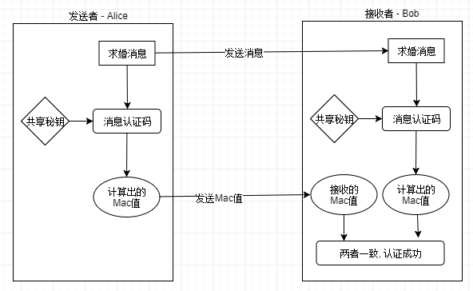
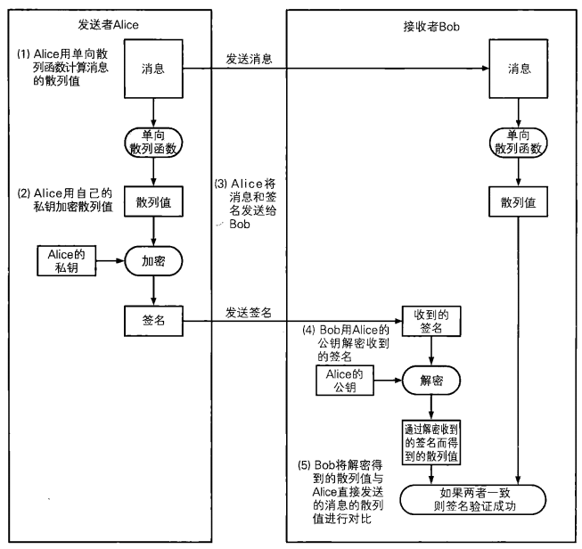
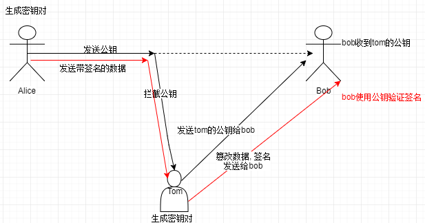

## 1. 消息认证码

### 1.1 消息认证

> **消息认证码（message authentication code）是一种确认完整性并进行认证的技术，取三个单词的首字母，简称为MAC。**


- 思考改进方案?

  从哈希函数入手

  需要将要发送的数据进行哈希运算, 将哈希值和原始数据一并发送

  需要在进行哈希运算的时候引入加密的步骤

   - 在alice对数据进行哈希运算的时候引入一个秘钥, 让其参与哈希运算, 生成散列值
   - bob对数据校验
      - bob收到原始和散列值之后, 
         - 处理原始数据: 通过秘钥和哈希算法对原始数据生成散列值
         - 散列值比较: 生成的散列值 和  接收到的散列值进行比对

### 1.2 消息认证码的使用步骤



> 1. 前提条件:
>    - 在消息认证码生成的一方和校验的一方, 必须有一个秘钥
>    - 双方约定好使用同样的哈希函数对数据进行运算
> 2. 流程:
>    - 发送者: 
>      - 发送原始消息
>      - 将原始消息生成消息认证码
>        - ((原始消息) + 秘钥)  *   哈希函数 = 散列值(消息认证码)
>      - 将消息认证码发送给对方
>    - 接收者:
>      - 接收原始数据
>      - 接收消息认证码
>      - 校验: 
>        - ( 接收的消息  +  秘钥 ) * 哈希函数   = 新的散列值
>        - 通过新的散列值和接收的散列值进行比较

### 1.3 go中对消息认证码的使用

> 有一个包: crypto/hmac
>
> ```go
> func New(h func() hash.Hash, key []byte) hash.Hash
> - 返回值: hash接口
> - 参数1: 函数函数的函数名
> 	sha1.new
> 	md5.new
> 	sha256.new
> - 参数2: 秘钥
> 
> 第二步: 添加数据
> type Hash interface {
>     // 通过嵌入的匿名io.Writer接口的Write方法向hash中添加更多数据，永远不返回错误
>     io.Writer
>     // 返回添加b到当前的hash值后的新切片，不会改变底层的hash状态
>     Sum(b []byte) []byte
>     // 重设hash为无数据输入的状态
>     Reset()
>     // 返回Sum会返回的切片的长度
>     Size() int
>     // 返回hash底层的块大小；Write方法可以接受任何大小的数据，
>     // 但提供的数据是块大小的倍数时效率更高
>     BlockSize() int
> }
> type Writer interface {
>     Write(p []byte) (n int, err error)
> }
> 第三步: 计算散列值
> ```

### 1.4 消息认证码的问题

1. 弊端
   - 有秘钥分发困难的问题
2. 无法解决的问题
   - 不能进行第三方证明
   - 不能防止否认

## 2. 数字签名

### 2.1 签名的生成和验证

> 1. 签名
>    - 有原始数据对其进行哈希运算   ->   散列值
>    - 使用非对称加密的<font color="red">私钥</font>对散列值加密 -> 签名
>    - 将原始数据和签名一并发送给对方
> 2. 验证
>    - 接收数据 
>      - 原始数据
>      - 数字签名
>    - 数字签名, 需要使用<font color="red">公钥</font>解密, 得到散列值
>    - 对原始数据进行哈希运算得到新的散列值

### 2.2 非对称加密和数字签名

> 总结: 
>
>  	1. 数据通信
>      - 公钥加密, 私钥解密
>     2. 数字签名:
>     - 私钥加密, 公钥解密

### 2.3 数字签名的方法



### 2.4 使用RSA进行数字签名

1. 使用rsa生成密钥对

   > 1. 生成密钥对
   > 2. 序列化
   > 3. 保存到磁盘文件

2. 使用私钥进行数字签名

   > 1. 打开磁盘的私钥文件
   >
   > 2. 将私钥文件中的内容读出
   >
   > 3. 使用pem对数据解码, 得到了pem.Block结构体变量
   >
   > 4. x509将数据解析成私钥结构体 -> 得到了私钥
   >
   > 5. 创建一个哈希对象 -> md5/sha1
   >
   > 6. 给哈希对象添加数据
   >
   > 7. 计算哈希值
   >
   > 8. 使用rsa中的函数对散列值签名
   >
   >    ```go
   >    func SignPKCS1v15(rand io.Reader, priv *PrivateKey, hash crypto.Hash, hashed []byte) (s []byte, err error)
   >    参数1: rand.Reader
   >    参数2: 非对称加密的私钥
   >    参数3: 使用的哈希算法
   >    	crypto.sha1
   >    	crypto.md5
   >    参数4: 数据计算之后得到的散列值
   >    返回值: 
   >    - s: 得到的签名数据
   >    - err: 错误信息
   >    ```

3. 使用公钥进行签名认证

   > 1. 打开公钥文件, 将文件内容读出 - []byte
   >
   > 2. 使用pem解码 -> 得到pem.Block结构体变量
   >
   > 3. 使用x509对pem.Block中的Bytes变量中的数据进行解析 ->  得到一接口
   >
   > 4. 进行类型断言 -> 得到了公钥结构体
   >
   > 5. 对原始消息进行哈希运算(和签名使用的哈希算法一致) -> 散列值
   >
   >    1. 创建哈希接口
   >    2. 添加数据
   >    3. 哈希运算
   >
   > 6. 签名认证 - rsa中的函数
   >
   >    ```go
   >    func VerifyPKCS1v15(pub *PublicKey, hash crypto.Hash, hashed []byte, sig []byte) (err error)
   >    参数1: 公钥
   >    参数2: 哈希算法 -> 与签名使用的哈希算法一致
   >    参数3: 将原始数据进行哈希原始得到的散列值
   >    参数4: 签名的字符串
   >    返回值: 
   >    	- nil -> 验证成功
   >    	- !=nil -> 失败
   >    ```

### 2.5 使用椭圆曲线进行数字签名

> 椭圆曲线在go中对应的包: import "crypto/elliptic"
>
> 使用椭圆曲线在go中进行数字签名: import "crypto/ecdsa"
>
> 美国FIPS186-2标准, 推荐使用5个素域上的椭圆曲线, 这5个素数模分别是:
>
> P~192~ = 2^192^ - 2^64^ - 1
>
> P~224~ = 2^224^ - 2^96^ + 1
>
> P~256~ = 2^256^ - 2^224^  + 2^192^ - 2^96^ -1
>
> P~384~ = 2^384^ - 2^128^  - 2^96^ + 2^32^ -1
>
> P~512~ = 2^512^ - 1

1. 秘钥对称的生成, 并保存到磁盘

   > 1. 使用ecdsa生成密钥对
   >
   >    ```go
   >    func GenerateKey(c elliptic.Curve, rand io.Reader) (priv *PrivateKey, err error)
   >    ```
   >
   > 2. 将私钥写入磁盘
   >
   >    - 使用x509进行序列化
   >
   >      ```go
   >      func MarshalECPrivateKey(key *ecdsa.PrivateKey) ([]byte, error)
   >      ```
   >
   >    - 将得到的切片字符串放入pem.Block结构体中
   >
   >      block := pem.Block{
   >
   >      	Type : "描述....",
   >    		
   >      	Bytes : MarshalECPrivateKey返回值中的切片字符串,
   >
   >      }
   >
   >    - 使用pem编码
   >
   >      pem.Encode();
   >
   > 3. 将公钥写入磁盘
   >
   >    - 从私钥中得到公钥
   >
   >    - 使用x509进行序列化
   >
   >      ```go
   >      func MarshalPKIXPublicKey(pub interface{}) ([]byte, error)
   >      ```
   >
   >    - 将得到的切片字符串放入pem.Block结构体中
   >
   >      block := pem.Block{
   >
   >      	Type : "描述....",
   >    		
   >      	Bytes : MarshalECPrivateKey返回值中的切片字符串,
   >
   >      }
   >
   >    - 使用pem编码
   >
   >      pem.Encode();

2. 使用私钥进行数字签名

   > 1. 打开私钥文件, 将内容读出来 ->[]byte
   >
   > 2. 使用pem进行数据解码 -> pem.Decode()
   >
   > 3. 使用x509, 对私钥进行还原
   >
   >    ```go
   >    func ParseECPrivateKey(der []byte) (key *ecdsa.PrivateKey, err error)
   >    ```
   >
   > 4. 对原始数据进行哈希运算 -> 散列值
   >
   > 5. 进行数字签名
   >
   >    ```go
   >    func Sign(rand io.Reader, priv *PrivateKey, hash []byte) (r, s *big.Int, err error)
   >    - 得到的r和s不能直接使用, 因为这是指针
   >    	应该将这两块内存中的数据进行序列化 -> []byte
   >    	func (z *Int) MarshalText() (text []byte, err error)
   >    ```

3. 使用公钥验证数字签名

   > 1. 打开公钥文件, 将里边的内容读出 -> []byte
   >
   > 2. pem解码 -> pem.Decode()
   >
   > 3. 使用x509对公钥还原
   >
   >    ```go
   >    func ParsePKIXPublicKey(derBytes []byte) (pub interface{}, err error)
   >    ```
   >
   > 4. 将接口 -> 公钥
   >
   > 5. 对原始数据进行哈希运算 -> 得到散列值
   >
   > 6. 签名的认证 - > ecdsa
   >
   >    ```go
   >    func Verify(pub *PublicKey, hash []byte, r, s *big.Int) bool
   >    - 参数1: 公钥
   >    - 参数2: 原始数据生成的散列值
   >    - 参数3,4: 通过签名得到的连个点
   >    	func (z *Int) UnmarshalText(text []byte) error
   >    ```

### 2.6 数字签名无法解决的问题

