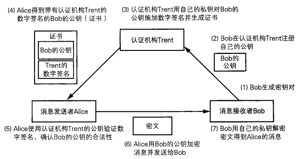
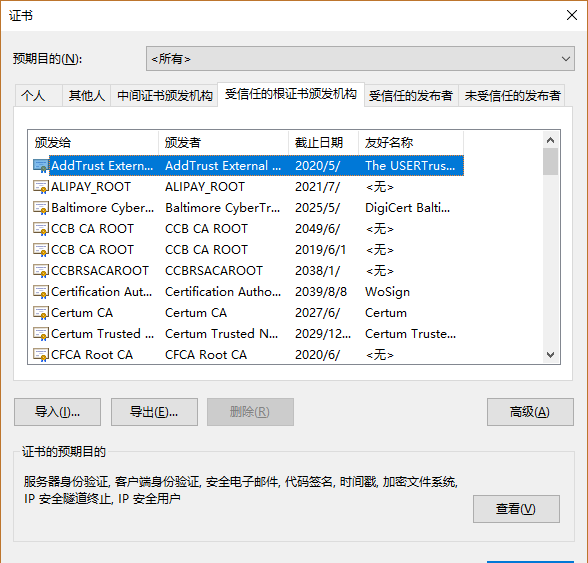
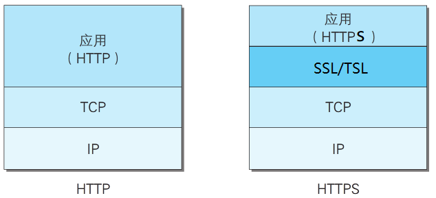
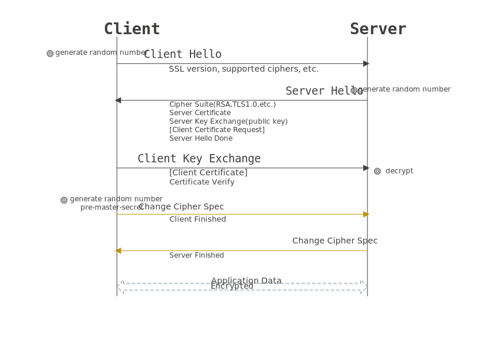

## 1. 证书

> 公钥证书（Public-Key Certificate，PKC)其实和驾照很相似，里面记有姓名、组织、邮箱地址等<font color="red">个人信息</font>，以及属于<font color="red">此人的公钥, 并由认证机构（Certification Authority、Certifying Authority, CA）施加数字签名</font>。只要看到公钥证书，我们就可以知道认证机构认定该公钥的确属于此人。公钥证书也简称为证书（certificate）。

### 1.1 证书的应用场景



> 1. <font color="red" size=4>Bob生成密钥对</font>
>    - 可以将bob看成百度, 提供是web服务器
>    - 生成一个密钥对
>      - 公钥  -> 分发
>      - 私钥 -> 百度留着
> 2. <font color="red" size=4>Bob在认证机构Trent注册自己的公钥</font>
> 3. - 百度找了一大家都信赖的机构, 来证明这个公钥是百度的
>    - 认证机构会生成一个证书, 写明了公钥属于百度
>      - 认证机构也有一个非对称加密的密钥对
>      - 认证机构使用自己的私钥对百度的公钥进行签名, 生成了证书
>      - 认证机构将证书发送给百度
> 4. <font color="red" size=4>认证机构Trent用自己的私钥对Bob的公钥施加数字签名并生成证书</font>
> 5. <font color="red" size=4>Alice得到带有认证机构Trent的数字签名的Bob的公钥（证书）</font>
>    - alice可以看做一个客户 -> 浏览器
>    - 客户端访问的百度 -> 得到了百度的证书
>      - 证书中有百度的公钥
>    - 客户端需要使用认证机构的公钥对证书进行验证
>      - 客户端怎么会有认证机构的公钥
>        - window会预装, 或者用户自己安装
> 6. <font color="red" size=4>Alice使用认证机构Trent的公钥验证数字签名，确认Bob的公钥的合法性</font>
>    - 使用认证机构的公钥解除百度证书中签名的数据
>      - 百度的公钥
>      - 百度的域名
>      - 百度证书的有效期
> 7. <font color="red" size=4>Alice用Bob的公钥加密消息并发送给Bob</font>
>    - 非对称加密
>    - 使用公钥加密 -> 对称加密秘钥分发
> 8. <font color="red" size=4>Bob用自己的私钥解密密文得到Alice的消息</font>
>    - 服务器使用私钥解密 -> 得到对称加密的秘钥

### 1.2 证书规范和格式 -- x509

> **X.509**是一种非常通用的证书格式。所有的证书都符合ITU-T X.509国际标准，因此(理论上)为一种应用创建的证书可以用于任何其他符合X.509标准的应用。X.509证书的结构是用ASN1(Abstract Syntax Notation One)进行描述数据结构，并使用ASN.1语法进行编码。 
>
> X.509规范中一般推荐使用PEM(Privacy Enhanced Mail）格式来存储证书相关的文件。
>
> - 证书文件的文件名后缀一般为 .crt 或 .cer 
> - 对应私钥文件的文件名后缀一般为 .key
> - 证书请求文件的文件名后綴为 .csr 
> - 有时候也统一用pem作为文件名后缀。

### 1.3  CA证书

> CA证书顾名思义就是由CA（Certification Authority）机构发布的数字证书。要对CA证书完全理解及其作用，首先要理解SSL。SSL（security sockets layer，安全套接层）是为网络通信提供安全及数据完整性的一种安全协议。SSL3.0版本以后又被称为TLS。SSL位于TCP与各应用层之间，是操作系统向外提供的API。SSL如何保证网络通信的安全和数据的完整性呢？就是采用了两种手段：身份认证和数据加密。首先身份认证就需要用到CA证书了。

1. 证书的获取和身份的认证

   > 客户端与服务端需要经过一个握手的过程才能完成身份认证，建立一个安全的连接。握手的过程如下：
   >
   > 1. 客户端访问服务器（比如：[https://www.12306.cn](https://www.12306.cn/)）,发送ssl版本、客户端支持的加密算法等消息。
   >
   > 2. 服务器向客户端发送ssl版本、加密算法、证书（证书出现了）等消息。
   >
   > 3. 客户端收到消息后，判断证书是否可信, 若可信，则继续通信，发送消息：
   >
   >    <font color="red">客户端生成一个随机数，从证书中获取服务器端的公钥，对随机数加密；</font>
   >
   >    随后信息都将使用双方协定的加密方法和密钥发送, 客户端握手结束。
   >
   > 4. 服务器端对数据解密得到随机数, 使用协商好的加密算法和秘钥进行通信

2. 客户端如何验证CA证书是可信任的?

   > 1. 查看证书的方式:
   >
   >    Internet选项 -> 内容 -> 证书, 打开证书窗口查看已经安装的证书
   >
   >    只要电脑上安装了该证书, 就说明该证书是受信任的。使用https协议访问时，服务器发送证书向浏览器时，首先查找该证书是否已在信任列表中，然后对证书进行校验，校验成功，那么就证明证书是可信的。
   >
   >    下图中`受信任的根证书颁发机构`下的证书都是根证书。
   >
   >    证书验证的机制是只要根证书是受信任的，那么它的子证书都是可信的。比如说，我们使用https协议访问了需要百度证书的网站，即使我们不安装百度证书，那么网站也不会提示证书不安全，因为，生成百度证书的根证书`Globalsign Root CA - R1`证书，在受信任的证书列表中。如果一个证书的根证书是不可信的，那么这个证书肯定也是不可信任的。
   >
   >    由以上可知，根证书在证书验证中极其重要，而且，根证书是无条件信任的，只要我们将根证书安装上，就说明我们对根证书是信任的。比如我们安装12306的根证书，是出于我们对国家的信任，对网站的信任，我们才放心安装这个根证书。对于一些不安全的网站的证书，一定要慎重安装。
   >
   >    另外需要知道的是，【`受信任的根证书颁发机构`】中的证书是windows预先安装的一些证书，都是国际上很有权威的证书机构，他们证书的生成都有很严格的流程，因此他们的证书被认为是安全，就像我们相信银行是安全，所以把钱存入到银行。

   

   > 2. 证书的颁发机构 -> CA
   >
   >    - 发布根证书
   >    - 中间证书
   >    - 个人
   >
   > 3. 证书的信任链 -> 证书签发机构的信任链
   >
   >    A是一个可信赖证书签发机构, A信任B, B就有资格去签发证书
   >
   >    从等级上A比B高一级
   >

3. 有哪些CA机构?

   > 世界上较早的数字认证中心是美国的verisign`威瑞信`公司，在windows的证书窗口中可以看到好多verisign公司生成的证书, 美国的*DigiCert*
   >
   > 另外还有加拿大的ENTRUST公司，也是很著名的证书机构。
   >
   > 中国的安全认证体系分为金融CA和非金融CA。
   >
   > - 在金融CA方面，根证书由中国人民银行管理，
   > - 非金融CA方面，由中国电信负责。
   >   - 行业性CA
   >     - 中国金融认证中心
   >     - 中国电信认证中心
   >   - 区域性CA, 区域性CA主要是以政府为背景，以企业机制运行
   >     - 广东CA中心
   >     - 上海CA中心
   >
   > 沃通 -- www.wosign.com/products/ssl.htm

### 1.4 公钥基础设施 - PKI

1. PKI组成的要素
   - 用户
     - 申请证书的人 -> web服务器端
       - 申请证书
         - 生成密钥对 , 或者委托ca生成
         - 将公钥发送给CA
         - ca使用自己的私钥对得到公钥签名
         - 将证书发送给用户
       - 发送证书
         - 当客户端访问服务器的时候发送证书给客户端
       - 注销证书
         - 当发现私钥泄露之后
     - 使用证书的人 -> 客户端
       - 接收证书
       - 验证对方的身份信息
   - CA认证机构
     - 可以生产密钥对(可选)
     - 对公钥签名
     - 吊销证书
   - 仓库
     - 存储证书 -> 公钥

## 2. SSL/TLS



> - **SSL**：（Secure Socket Layer，安全套接字层），为Netscape所研发，用以保障在Internet上数据传输之安全，利用数据加密(Encryption)技术，可确保数据在网络上之传输过程中不会被截取。当前版本为3.0。它已被广泛地用于Web浏览器与服务器之间的身份认证和加密数据传输。
>   SSL协议位于TCP/IP协议与各种应用层协议之间，为数据通讯提供安全支持。SSL协议可分为两层： SSL记录协议（SSL Record Protocol）：它建立在可靠的传输协议（如TCP）之上，为高层协议提供数据封装、压缩、加密等基本功能的支持。 SSL握手协议（SSL Handshake Protocol）：它建立在SSL记录协议之上，用于在实际的数据传输开始前，通讯双方进行身份认证、协商加密算法、交换加密密钥等。
> - **TLS**：(Transport Layer Security，传输层安全协议)，用于两个应用程序之间提供保密性和数据完整性。
>   TLS 1.0是IETF（Internet Engineering Task Force，Internet工程任务组）制定的一种新的协议，它建立在SSL 3.0协议规范之上，是SSL 3.0的后续版本，可以理解为SSL 3.1，它是写入了 [RFC](http://tools.ietf.org/html/rfc5246) 的。该协议由两层组成： TLS 记录协议（TLS Record）和 TLS 握手协议（TLS Handshake）。较低的层为 TLS 记录协议，位于某个可靠的传输协议（例如 TCP）上面。
>
> SSL/TLS协议提供的服务主要有：
>
> 1. 认证用户和服务器，确保数据发送到正确的客户机和服务器；
> 2. 加密数据以防止数据中途被窃取；
> 3. 维护数据的完整性，确保数据在传输过程中不被改变。



1. 描述的是客户端和服务器刚建立连接之后做的事情

   第一次

   - 客户端连接服务器
     - 客户端使用的ssl版本, 客户端支持的加密算法
   - 服务器
     - 先将自己支持ssl版本和客户端的支持的版本比较
       - 支持的不一样, 连接断开
       - 支持的一样, 继续
     - 根据得到的客户端支持 的加密算法, 找一个服务器端也同样支持算法, 发送给客户端
     - 需要发送服务器的证书给客户端

   第二次:

   客户端:

    - 接收服务器的证书
    - 校验证书的信息
       - 校验证书的签发机构
       - 证书的有效期
       - 证书中支持 的域名和访问的域名是否一致
   - 校验有问题, 浏览器会给提示

## 3. https -> 单向认证


1. 服务器要准备的
   - 生成密钥对
   - 将公钥发送给ca, 由ca签发证书
   - 将ca签发的证书和非对称加密的私钥部署到当前的web服务器
2. 通信流程
   1. 客户端连接服务器, 通过一个域名
      - 域名和IP地址的关系
        - 域名要绑定IP地址
          - 一个域名只能绑定一个IP地址
        - IP地址需要被域名绑定
          - 一个IP地址可以被多个域名绑定
      - 客户端访问的域名会别解析成IP地址, 通过IP地址访问web服务器
   2. 服务器收到了客户端的请求
      - 服务器将CA签发的证书发送给浏览器(客户端)
   3. 客户端拿到了服务器的公钥证书
      - 读这个公钥 证书
        - 验证域名
        - 有效期
        - ca签发机构
        - 服务器的公钥
   4. 客户会生成一个随机数 (作为对称加密的秘钥来使用的)
      - 使用服务器的公钥就这个随机数进行加密
      - 将这个加密之后 秘钥发送给服务器
   5. 服务器对收到的密文解密
      - 使用服务器的是要解密, 得到对称加密的秘钥
   6. 数据的传输
      - 使用对称加密的方式对数据进行加密

## 4. 自签名证书

1. 使用openssl生成自签名证书

   1. 创建一个目录如Mytest, 进入该目录, 在该目录下打开命令行窗口

   2. 启动openssl

      ```shell
      openssl    # 执行该命令即可
      ```

   3. 使用openssl工具生成一个RSA私钥, 注意：生成私钥，需要提供一个至少4位的密码。

      ```shell
      genrsa -des3 -out server.key 2048
      	- des3: 使用3des对私钥进行加密
      ```

   4. 生成CSR（证书签名请求）

      ```shell
      req -new -key server.key -out server.csr
      ```

   5. 删除私钥中的密码, 第一步给私钥文件设置密码是必须要做的, 如果不想要可以删掉

      ```shell
      rsa -in server.key -out server.key
      	-out 参数后的文件名可以随意起
      ```

   6. 生成自签名证书

      ```shell
      x509 -req -days 365 -in server.csr -signkey server.key -out server.crt
      ```


   ## 复习

   1. 消息认证码

      - 是什么?
        - 散列值
      - 能干什么?
        - 保证数据的完整性, 一致性
      - 怎么生成?
        - 准备的条件:  Hmac
          - 原始数据
          - 共享秘钥 -> 认证的另一方需要有同样的秘钥
          - 哈希算法
      - 弊端:
        - 秘钥分发困难
          - 使用非对称加密
        - 不能第三方认证
        - 不能防止否认

   2. 数字签名

      - 是什么?
        - 签名
          - 签名的人生成非对称加密的密钥对
          - 签名的人将公钥进行分发
          - 签名的人将原始数据进行哈希运算 -> 散列值
          - 签名的人使用自己的私钥对散列值进行非对称加密 -> 最终得到的数据就是签名
        - 校验:
          - 接收签名人的公钥
          - 接收签名人发送的数据和签名数据
          - 对原始数据进行哈希运算 -> 散列值
          - 使用公钥对签名数据解密
          - 将解密出的数据和散列值进行比较
            - 相等 == 成功
            - 不..  == 失败
      - 干什么?
        - 保证数据的一致性
        - 进行第三方认证
        - 可以防止否认

      - 能解决消息认证的弊端吗?

        - 可以

      - 怎么进行签名

        - RSA

        - 椭圆曲线签名 -> ecdsa

          > 1. 生成密钥对, 保存到文件中
          > 2. 对公钥进行分发
          > 3. 签名的人
          >    - 将私钥从磁盘读出
          >    - pem解码
          >    - x509解码 -> 私钥结构体
          >    - 对原始数据进行哈希运算 -> 散列值
          >    - 签名
          > 4. 验证签名的人
          >    - 将公钥从磁盘读出
          >    - pem解码
          >    - x509解码 -> 公钥
          >    - 生成原始数据的散列值
          >    - 签名认证

        数字签名的缺陷?

        - 验证签名的一方没有办法判断得到的公钥到底属于谁